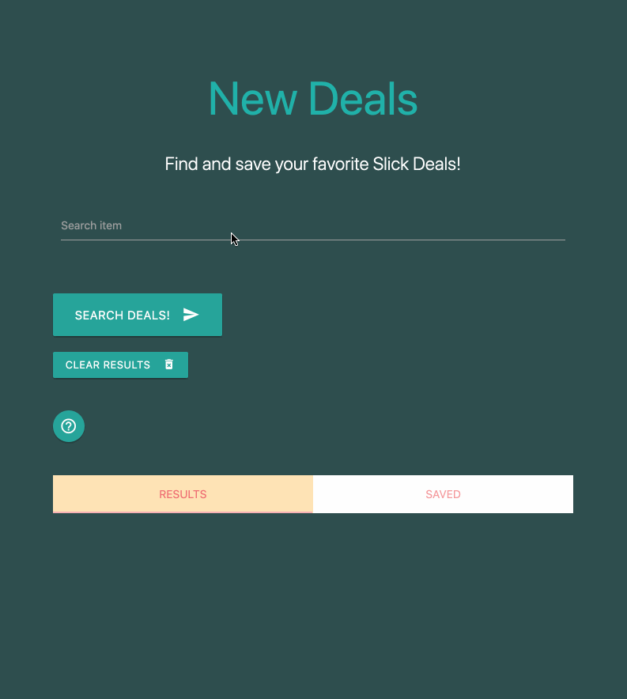
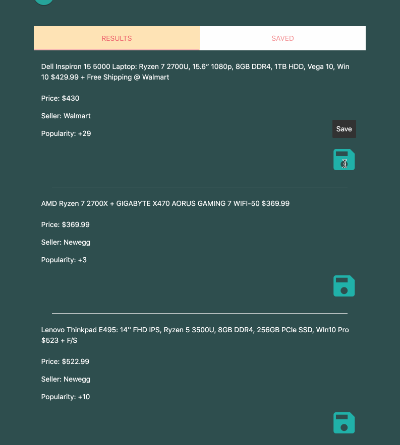
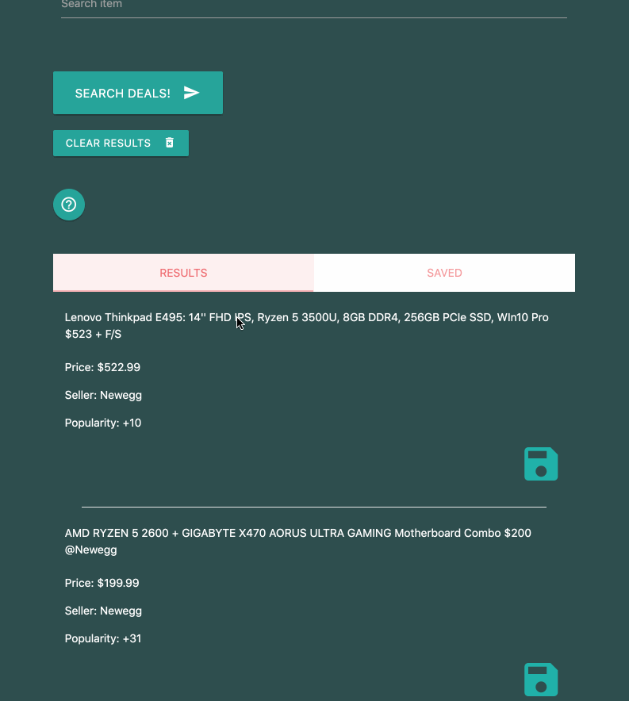

# Slick Deals Scraper (Express, Node, Handlebars, MongoDB)
Demo: https://limitless-bayou-66969.herokuapp.com/

# Application
- Search for deals by typing in an item. Save your favorite deals for later!
- This deals scraper uses `npm cheerio` and `npm axios` to webscrape for deals. Information is saved in MongoDB using `npm mongoose` and the concept of an ODM.

### Start by searching for a deal! (Cheerio.js)


### Save your favorite deals! (MongoDB / Mongoose.js)


### Utilize the help menu if you are lost! (Materialize.css)


# Configuration
- `git clone <repo>`
- `npm install`
- Configure MongoDB connection in `server.js`:
```javascript
  // connect mongodb heroku
  const MONGODB_URI = process.env.MONGODB_URI || 'mongodb://localhost:27017/<DATABASE_NAME>';
  mongoose.connect(MONGODB_URI, { useNewUrlParser: true, useUnifiedTopology: true });
```
> `process.env.MONGODB_URI` for heroku deployment. `mongodb://localhost:27017/<DATABASE_NAME>` add your database.

- Create schema model and requirements in `Deals.js`:
```javascript
  const mongoose = require('mongoose');
  ...
  const DealsSchema = new Schema({

      title: {
          type: String,
          required: true,
          unique: true
      }
  ...
```

# Technologies:
- Express.js
- Node.js
- MongoDB / Mongoose
- Handlebars.js
- Cheerio.js
- Materialize.css